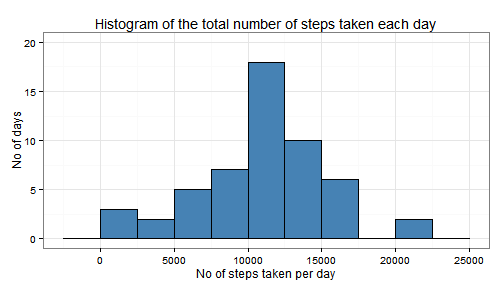
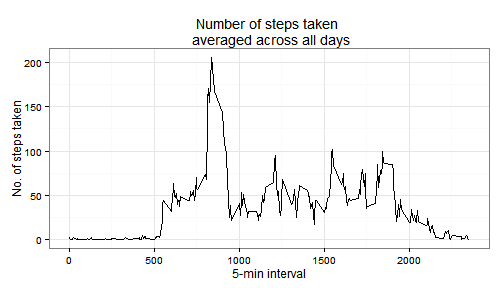
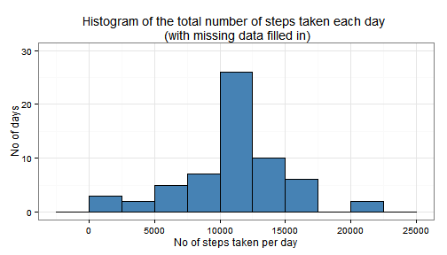
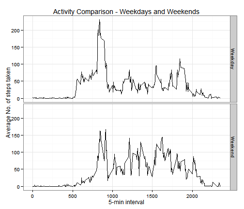

Reproducible Research Assignment 1
======================================

**Loading and preprocessing the data**

```r
require(ggplot2)
unzip("activity.zip")
df<-read.csv("activity.csv")
```

**What is the mean total number of steps per day?** 

1. Make a histogram of the total number of steps taken each day

```r
dstep<-aggregate(steps~date, data=df, sum, na.rm=T)
P1<-ggplot(dstep, aes(steps)) + theme_bw()
P1 + geom_histogram(binwidth=2500, fill="steelblue", color="black") +
  scale_y_continuous("No of days", limits=c(0,20)) + xlab("No of steps taken per day") +
  ggtitle("Histogram of the total number of steps taken each day")
```

 

2. Calculate and report the mean and median total number of steps taken per day

```r
(Q2a<-mean(dstep$step))
```

```
## [1] 10766.19
```

```r
(Q2b<-median(dstep$step))
```

```
## [1] 10765
```
_The mean and median total number of steps taken per day is **10,766.19** and **10,765** respectively_  

**What is the average daily activity pattern?**  
1. Make a time series plot (i.e. type = "l") of the 5-minute interval (x-axis) and the average number of steps taken, averaged across all days (y-axis)

```r
avint<-aggregate(steps~interval, data=df, mean)
P2<-ggplot(avint, aes(x=interval, y=steps)) + theme_bw()
P2 + geom_line() +
  xlab("5-min interval") + ylab("No. of steps taken") +
  ggtitle("Number of steps taken \n averaged across all days")
```

 

2. Which 5-minute interval, on average across all the days in the dataset, contains the maximum number of steps?

```r
(Q3<-avint[avint$steps==max(avint$steps),])
```

```
##     interval    steps
## 104      835 206.1698
```
_The 5-minute interval, averaged across all days that contains the highest number of steps, is **835**_  

**Imputing missing values**  
1. Calculate and report the total number of missing values in the dataset (i.e. the total number of rows with NAs)

```r
(Q4<-sum(is.na(df$steps)))
```

```
## [1] 2304
```
_There are **2,304** missing values in the dataset_  

2. Devise a strategy for filling in all of the missing values in the dataset.  
_Missing values will be replaced by the average number of steps (rounded to integers) for each interval (avint), calculated in the previous question_

3. Create a new dataset that is equal to the original dataset but with the missing data filled in.

```r
#Create new dataframe df1 from df and avint, merged by interval
df1<-merge(df,avint, by="interval")
#New variable - taking value from average for interval if original steps is missing 
df1$steps<-as.integer(ifelse(is.na(df1$steps.x),round(df1$steps.y,0),df1$steps.x))
```

4. Make a histogram of the total number of steps taken each day

```r
dstep1<-aggregate(steps~date, data=df1, sum)
P3<-ggplot(dstep1, aes(steps)) + theme_bw()
P3 + geom_histogram(binwidth=2500, fill="steelblue", color="black") +
  scale_y_continuous("No of days", limits=c(0,30)) + xlab("No of steps taken per day") +
  ggtitle("Histogram of the total number of steps taken each day \n (with missing data filled in)")
```

 
   
 and calculate and report the mean and median total number of steps taken per day.

```r
(Q4a<-mean(dstep1$step))
```

```
## [1] 10765.64
```

```r
(Q4b<-median(dstep1$step))
```

```
## [1] 10762
```
_The mean and median total number of steps taken per day, with missing data filled in is **10,765.64** and **10,762** respectively_  

Do these values differ from the estimates from the first part of the assignment? What is the impact of imputing missing data on the estimates of the total daily number of steps?

_Yes, both the mean and median values differ slightly from the estimates from the first part of the assignment. The new mean is higher by 0.6393443 whilst the new median is lower by 3 than the first estimate_  

**Are there differences in activity patterns between weekdays and weekends?**  
1. Create a new factor variable in the dataset with two levels - "weekday" and "weekend" indicating whether a given date is a weekday or weekend day.

```r
df1$wd<-factor(ifelse(weekdays(as.Date(df1$date),T) %in% c("Sat","Sun"),"Weekend","Weekday"))
```

2. Make a panel plot containing a time series plot (i.e. type = "l") of the 5-minute interval (x-axis) and the average number of steps taken, averaged across all weekday days or weekend days (y-axis)


```r
AWk<-aggregate(steps~wd+interval, data=df1,FUN=mean)
P4<-ggplot(AWk, aes(x=interval, y=steps)) + theme_bw()
P4 + geom_line() + facet_grid(wd~.) +
  xlab("5-min interval") + ylab("Average No. of steps taken") +
  ggtitle("Activity Comparison - Weekdays and Weekends")
```

 

